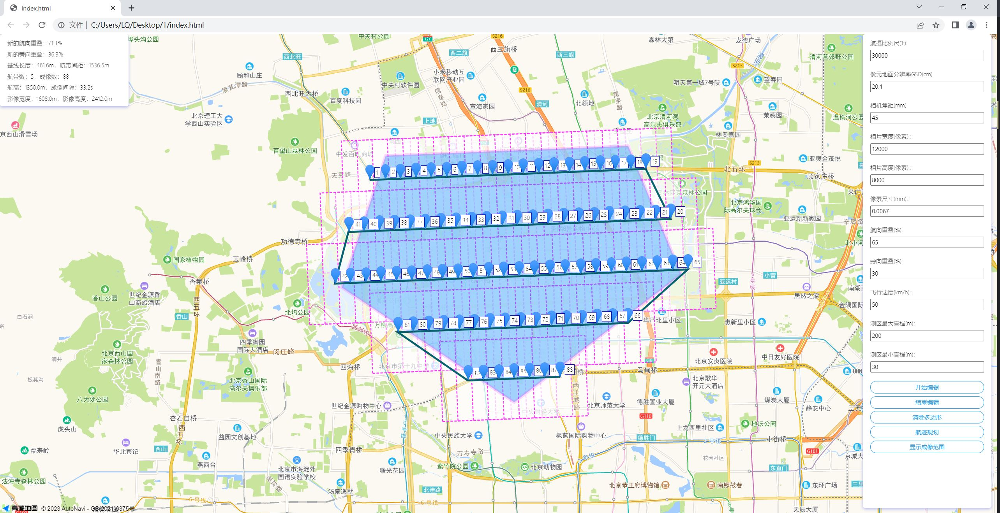
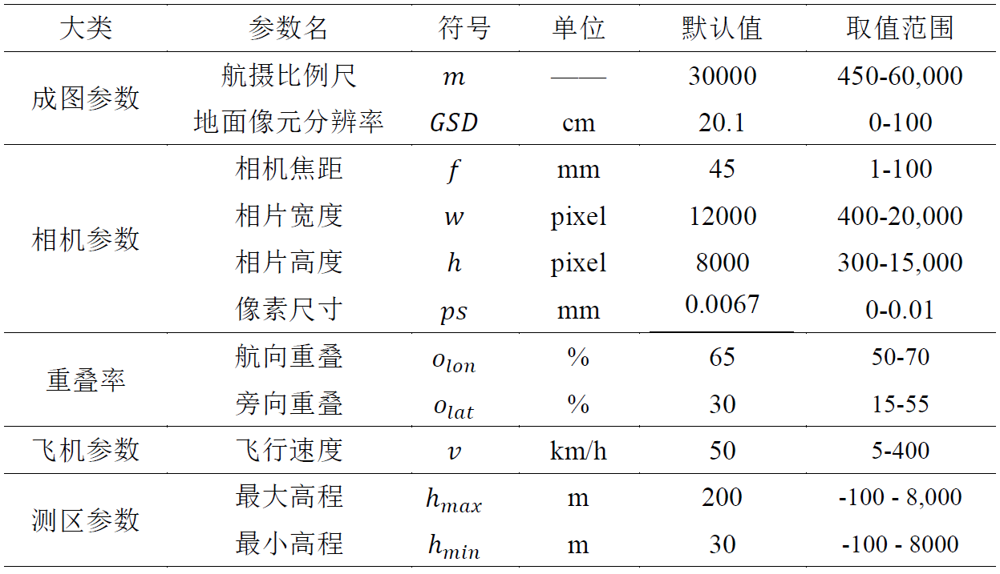

# route-planning-Photogrammetry
+ 摄影测量作业之凸多边形航迹规划+高地地图API可视化
+ 申请高德API后，将代码第8行的your_key改写为自己的key值即可

## 参数选择
 + 参数选择界面在网页右侧，可由用户自行输入。其中各个参数的范围如下图所示。
 + 
 + 其中航摄比例尺、地面像元分辨率和像素尺寸之间遵守下式的关系，用户修改航摄比例尺或地面像元分辨率时，另一项会随之更改，用户修改像素尺寸时，航摄比例尺会发生改变。
 + $m=GSD/ps$
## 测区绘制
+ 用户点击“开始编辑”按键即可开始编辑测区，用鼠标在地图上描点即可，用户还可以拖拽已经添加的多边形顶点，可以单击已经添加的顶点删除。
+ 用户点击“结束编辑”按键即可结束编辑，点击“清除多边形”按键即可清空当前测区。
## 航迹规划
+ 用户点击“航迹规划”按键即可由程序计算所需参数并进行航迹规划，规划的航线、摄影位置以及拍摄结果会在地图上显示。
+ 同时，计算得到的参数会在左上角显示。
+ 规划结果包括其他计算参数、航迹、拍摄点位置以及成像范围会记录在*download（下载）* 目录下的*result.json*文件下。
## 可视化
+ 用户将鼠标移到成像点上时会显示成像点的经纬度。
+ 在航迹规划后，用户点击“显示成像范围”按键即可显示成像范围，显示后按键会改为“隐藏成像范围”，再按下即为隐藏。本程序默认显示成像范围。
